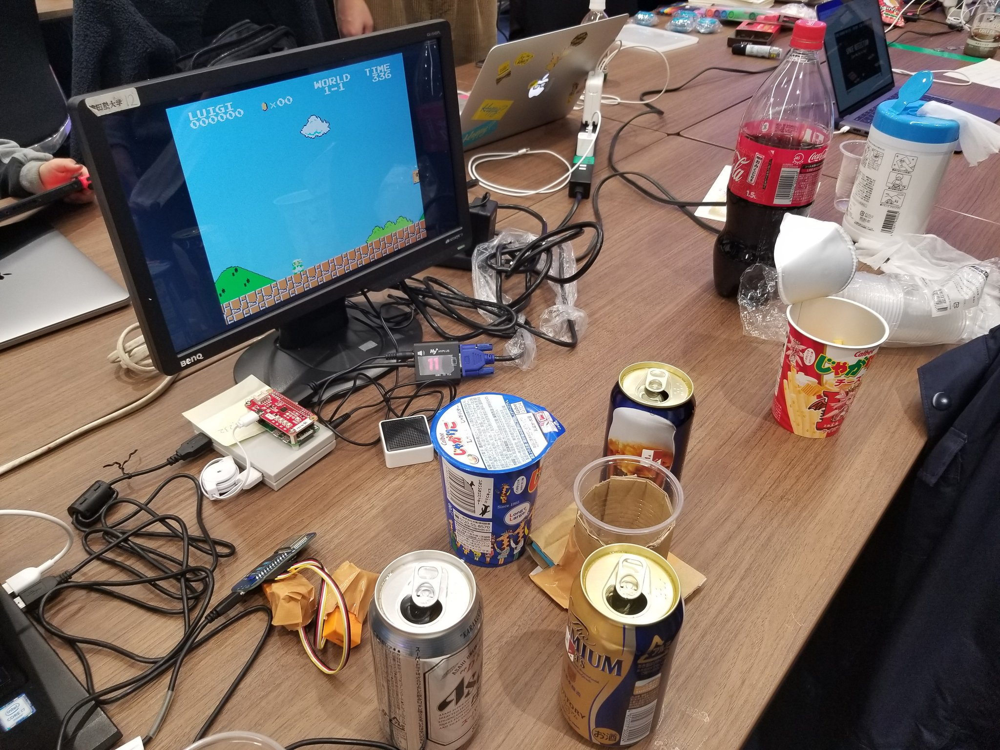
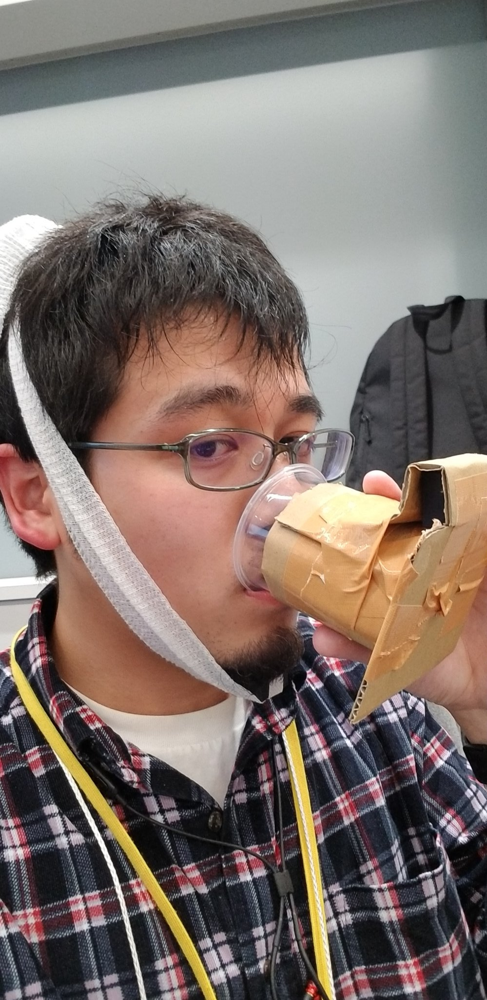

# SUPER DRUNK BROS.（仮）

## アルコールは燃料。

じゃがりことお酒でマリオを操作しろ！

- じゃがりこを食べるとマリオが少し前進！
- 飲み物を飲むとジャンプ移動！

## イベントについて

[【参加費無料】GameControllerizer教室＆ハッカソン #ma_2019](https://mashupawards.connpass.com/event/120523/)で作成しました．

- 同イベントに参加の，シオタニさんとの合同作品です．

- またarm賞とコミュニティ賞をいただきました．🙌

## システムの構成

- GameControllerizer
  - rasPiと接続しNode-REDが起動しているものなのでRESTAPIでコマンドを入力可能
- MESH
  - 動きセンサ
    - 顎: 咀嚼の検知
    - コップ: 飲んだことの検知
      - 本来はMESH SDKを用いてHTTPrequestしたかったけど，挙動が不安定だった
  - ライト
    - 後述の光センサへ入力を渡す
- obniz
  - 光センサ
    - MESHからの入力を受け取る
    - このおかげでワイヤレスになったのが地味に良い
  - HTTPrequest
    - GameControllerizerのアドレスへGETを叩く

## 感想と反省点
- やはり入力遅延は気になる
  - MESHかobnizで完結させる
    - あと振動センサの値変化がうまく取れなかった
- 行き当たりばったりでコード書いてたので，時々数値ミスをした
  - センサのモジュールをクラスすればよかった
- プレイを見ている周りの人の楽しさについて評価されたのが嬉しかった

- 折角hackするのだから，それこそ金魚の動きで操作みたいなことをしたいなと考えていて，ちょうどアイデア出しの際にシオタニさんのアイデアに協力することができた